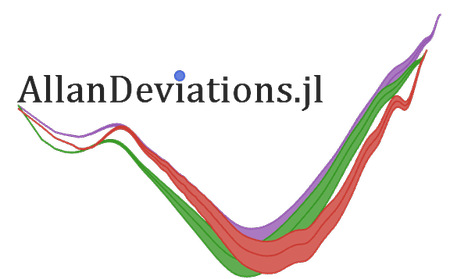

AllanDeviations.jl is a package for the Julia programming language
and provides various frequency- and phase-stability deviations (or variances) in overlapping
and consecutive forms.

Currently implemented are:

|Deviation|Function name|Phase Data|Frequency Data|Consecutive|Overlapping|
|---------|:------------|:--------:|:------------:|:---------:|:---------:|
|Allan deviation|`allandev`|✓|✓|✓|✓|
|Modified Allan deviation|`mallandev`|✓|✓|✓|✓|
|Hadamard deviation|`hadamarddev`|✓|✓|✓|✓|
|Time deviation|`timedev`|✓|✓|✓|✓|
|Total deviation|`totaldev`|✓|✓|✓|✓|
|Maximal time interval error|`mtie`|✓|✓|✓|✓|


---
|Build & Tests<br>(Julia v1.0.0 & upwards)| |Code test coverage| | Documentation |
|-------------|-|------------------|-|------------------|
|[](https://ci.appveyor.com/project/JulienKluge/allandeviations-jl/branch/master)| |[](https://coveralls.io/github/JulienKluge/AllanDeviations.jl?branch=master)| | [](https://JulienKluge.github.io/AllanDeviations.jl/stable/) |
[](https://travis-ci.org/JulienKluge/AllanDeviations.jl)| |[](https://codecov.io/gh/JulienKluge/AllanDeviations.jl)| | [](https://JulienKluge.github.io/AllanDeviations.jl/latest/) |

---
## Usage

### Installing (v1.0.0 and higher)
To install AllanDeviations.jl open up a Julia REPL/Console and type:
```Julia
using Pkg;
Pkg.add("AllanDeviations")
```
This installs the package along with any dependencies needed.

### Example code

The following code calculates the overlapping Allan deviation of a given data array `arr` and rate `r` with log2 spaced averaging times τ.
```Julia
using AllanDeviations

(tau, deviation, error, count) = allandev(arr, r)			#assuming phase data

(tau, deviation, error, count) = allandev(arr, r, frequency = true)	#assuming frequency data
(tau, deviation, error, count) = allandev(arr, r, overlapping = false)	#non-overlapping/consecutive
```
Every function returns a simple named tuple `(tau, deviation, error, count)`. `tau` is an array of the averaging times used. `deviation` are the respective calculated deviations, `error` the respective errors of the deviations and `count` is the number of terms contributing to every deviation.<br>The errors are calculated by `error .= deviation ./ sqrt.(count)`.

The averaging times τ can also be finely tuned:
```Julia
using AllanDeviations

allandev(arr, r)				#log_2 spaced tau distribution: octave

allandev(arr, r, taus = AllTaus)		#uses every possible tau value

allandev(arr, r, taus = Octave)			#log_2 spaced: octave (default)
allandev(arr, r, taus = HalfOctave)		#log_1.5 spaced: half octave
allandev(arr, r, taus = QuarterOctave)		#log_1.25 spaced: quarter octave
allandev(arr, r, taus = Decade)			#log_10 spaced: decade
allandev(arr, r, taus = HalfDecade)		#log_5 spaced: half decade

allandev(arr, r, taus = 1.1)			#log_1.1 spaced

allandev(arr, r, taus = [1.0, 2.0, 3.0])	#calculates at τ = 1.0, τ = 2.0 and τ = 3.0 if possible
allandev(arr, r, taus = [0.4])			#calculates at τ = 0.4 if possible
```

#### CSV example
This example shows how to load data from a csv file (via the CSV package), calculate the overlapping allan deviation with it and to output a plot (via the Plots package) in the same directory:

```Julia
using AllanDeviations, CSV, Plots

data = CSV.read("fractionalFrequencyData.csv")	#load data
freq = data[:, 2]				#extract fractional frequency
rate = length(data[:, 1]) / data[end, 1]	#calculate rate

result = allandev(freq, rate, frequency = true)	#calculate overlapping allan deviation

plot(result.tau, result.deviation, xscale = :log10, yscale = :log10) #log-log plot everything
savefig("allanDevPlot.png") #save the plot
```
> 

---
## References
+ [NIST - Riley, William J. "Handbook of frequency stability analysis." (2008): 81.](https://nvlpubs.nist.gov/nistpubs/Legacy/SP/nistspecialpublication1065.pdf)
+ [C Reference implementations: leapsecond.com](http://www.leapsecond.com/tools/adev_lib.c)
+ [Python Package: AllanTools](https://pypi.org/project/AllanTools/)